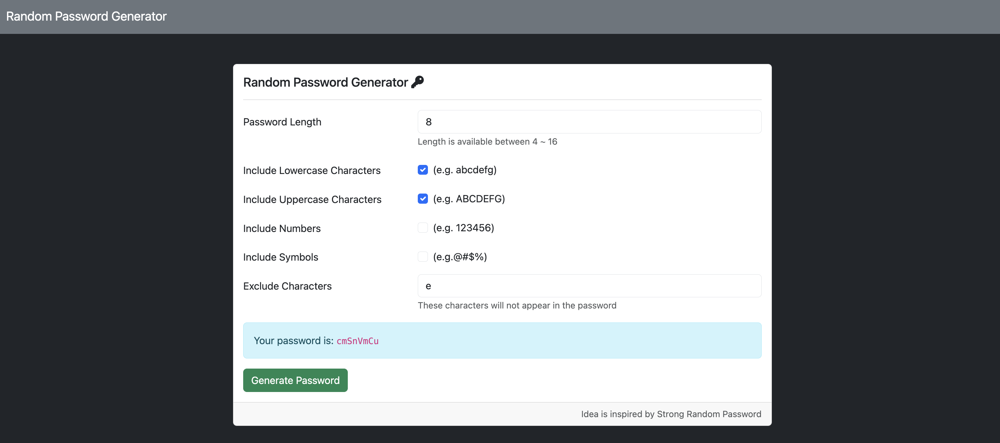

# 密碼亂數產生器


## 介紹
依選項亂數產生密碼 （AC作業）

### 功能
- 可自訂字數 (4至16位數)
- 可選擇組合：英文大小寫、數字、標點符號
- 可自訂不要的字元

### 開始使用
1. 需有安裝 Node.js 以及 npm
2. 將此專案 clone 至本地
3. 從終端機進入此專案資料夾，輸入以下指令安裝套件
```
npm install
```
4. 安裝完畢後，輸入以下指令啟動專案
```
npm run start
```
5. 若終端機顯示 "The Express server is running on http://localhost:3000" 則代表專案運行正常，請打開瀏覽器輸入以下網址
```
http://localhost:3000
```
6. 終止專案請於終端機輸入
```
ctrl + c
```

## 開發工具
- Node.js 18.16.0
- Express 4.18.2
- Express-Handlebars 3.0.0